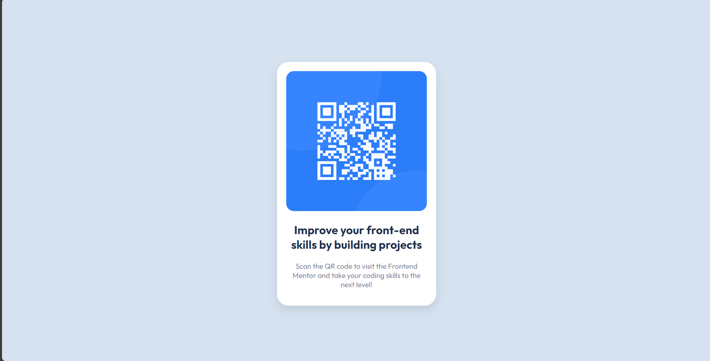

# Frontend Mentor - QR code component solution

This is a solution to the [QR code component challenge on Frontend Mentor](https://www.frontendmentor.io/challenges/qr-code-component-iux_sIO_H). Frontend Mentor challenges help you improve your coding skills by building realistic projects.

## Table of contents

- [Overview](#overview)
  - [Screenshot](#screenshot)
  - [Links](#links)
- [My process](#my-process)
  - [Built with](#built-with)
  - [What I learned](#what-i-learned)
  - [Continued development](#continued-development)
  - [Useful resources](#useful-resources)
- [Author](#author)

**Note: Delete this note and update the table of contents based on what sections you keep.**

## Overview

### Screenshot



### Links

- Solution URL: [GITHUB](https://github.com/DemuraAIdev/qr-code-component-main)
- Live Site URL: [Live site URL](https://qr-code-component-main-eta-five.vercel.app/)

## My process

### Built with

- Semantic HTML5 markup
- CSS custom properties

### What I learned

Now i know hot to use :

```css
.proud-of-this-css {
  font-weight: 400;
}
```

### Continued development

I will update my website for this

### Useful resources

- [Outifit Font](https://fonts.google.com/specimen/Outfit) - This helped me for XYZ reason. I really liked this pattern and will use it going forward.

## Author

- Website - [Vahry iskandar](https://vahryiskandar.my.id/)
- Frontend Mentor - [@DemuraAIdev](https://www.frontendmentor.io/profile/DemuraAIdev)
